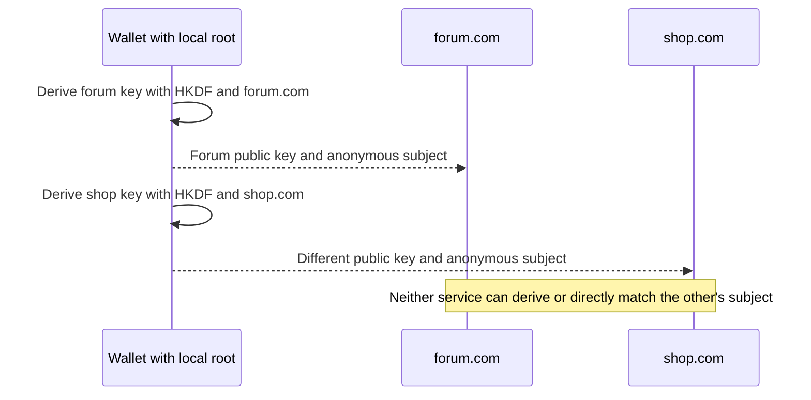
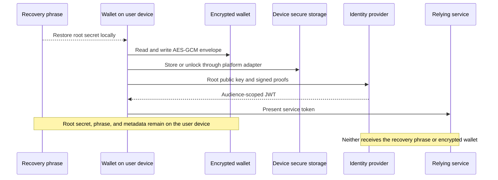
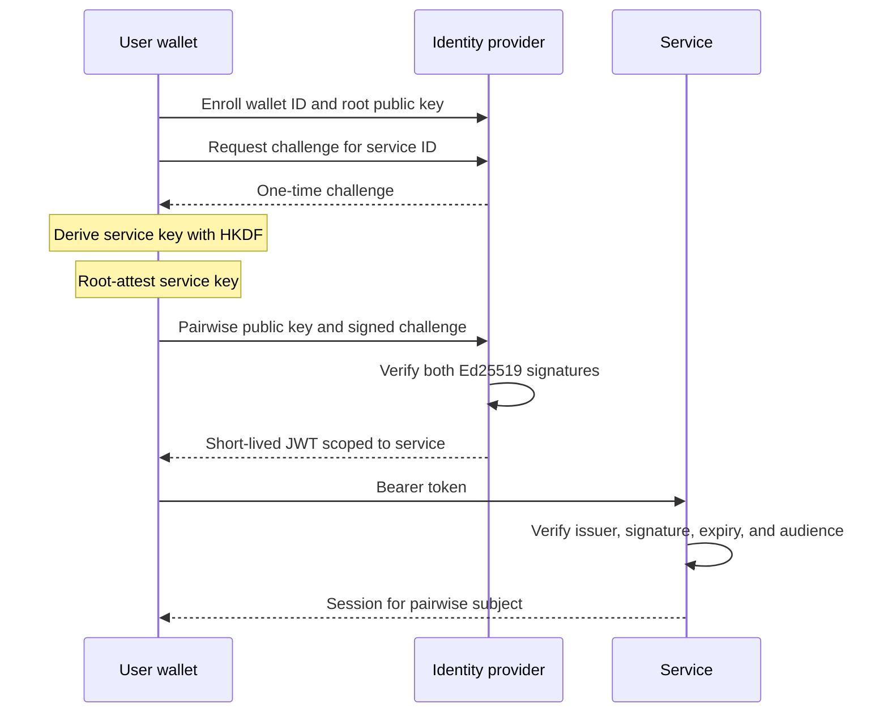
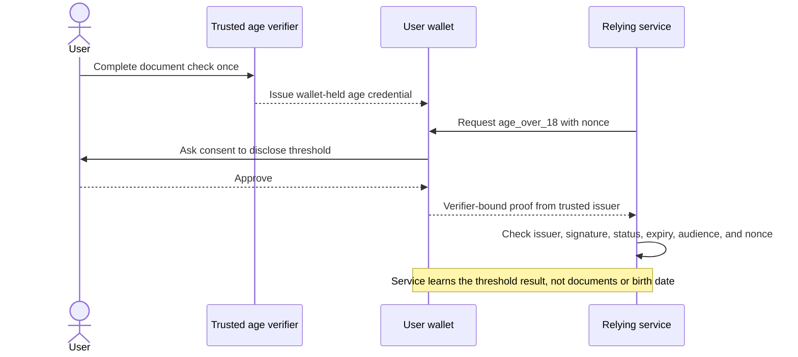
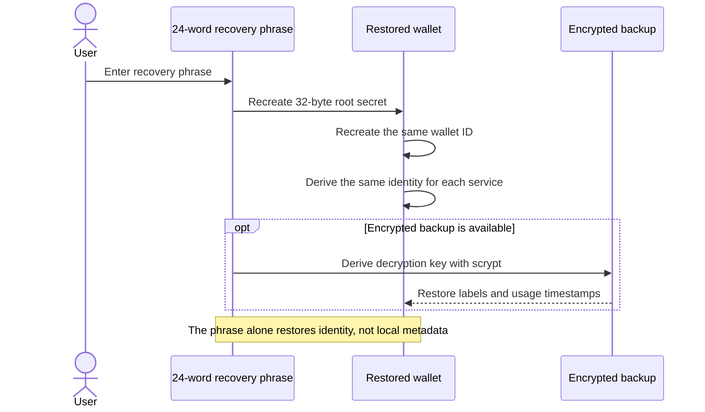

# Anonymous Identity

Anonymous Identity is an educational identity-provider prototype built around a
user-owned root identity. Instead of presenting the same account identifier to
every service, the wallet deterministically creates a different signing key and
pseudonymous subject for each service.

The project explores a practical question: **can a person authenticate reliably
without giving every service a shared identifier?**

> This is a research prototype, not a production authentication system. It
> provides pairwise pseudonymity between services; it does not provide network
> anonymity, and the current identity provider can correlate login activity.

## Why this exists

Conventional identity systems make account recovery and single sign-on
convenient, but they commonly place one stable user identity at the center of
many unrelated relationships. That creates several problems:

- Services can correlate accounts when they receive the same identifier.
- A central identity provider becomes a high-value source of identity history.
- Users depend on an operator to retain access to their identity.
- A provider breach or policy change can affect every connected account.

This project tests a different division of responsibility. The user keeps the
root secret and recovery material. Services receive only a deterministic identity
created for their own domain. The provider verifies proofs and issues scoped,
short-lived tokens without receiving the root secret.

## Security-first design

Encryption is a core boundary, not an optional storage feature:

- **At rest:** the wallet root, service metadata, and future credentials are
	stored only inside an AES-256-GCM authenticated envelope. A per-write random
	salt and nonce are used, and scrypt derives the encryption key from the
	recovery phrase.
- **In transit:** production deployments must use authenticated TLS for every
	wallet, provider, issuer, and service connection. Application signatures do
	not replace transport security.
- **During synchronization:** future sync services should receive only opaque
	encrypted wallet envelopes. Decryption keys and recovery phrases must remain
	on user-controlled devices.
- **In use:** decrypted secrets should exist only as long as needed and should
	use platform secure storage or hardware-backed keys where available. The
	current Python prototype cannot guarantee protection from a compromised or
	unlocked device.

The project uses reviewed cryptographic primitives from established libraries
and does not invent encryption algorithms. Any production release would still
require protocol review, implementation audit, hardened key lifecycle handling,
and tested backup, rollback, rotation, and device-revocation procedures. See the
[encrypted wallet threat model](docs/wallet-format.md) for the precise guarantees
and limitations implemented today.

## Core idea

One wallet can produce stable identities that are different across services:

The same wallet returns to a service with the same pairwise identity, so an
account remains usable. A different service receives a different public key and
subject, so those identifiers cannot directly be matched. Pairwise keys are
derived when needed and are not stored separately.

## Architecture

The prototype has three active roles:

| Role | Responsibility | Data it sees |
| --- | --- | --- |
| Wallet | Holds the root, derives pairwise keys, and signs challenges | Root secret, recovery phrase, and local service metadata |
| Identity provider | Enrolls root public keys, verifies proofs, and issues tokens | Wallet ID, root public key, requested service, and pairwise proof |
| Relying service | Validates a token issued specifically for itself | Its own pairwise subject and token claims |

The encrypted wallet is a portable, authenticated blob. Its revision field is
intended to support future synchronization and conflict detection. The current
implementation stores it locally and exposes an optional secure-storage adapter.
The adapter is not part of the identity protocol. A production client should
integrate with the platform's available credential vault or hardware-backed
keystore. Remote synchronization is not implemented yet.

## Authentication flow

The root signature authorizes the service-specific key. The pairwise signature
proves control of that key for one fresh challenge. Challenges expire and are
consumed once, limiting replay.

## Age assurance

Anonymous Identity is intended to support reusable age verification without
repeatedly sending identity documents to unrelated websites. A trusted age
verifier checks the user's evidence once and issues a signed credential to the
wallet. A service can then request only the threshold it needs, such as
`age_over_18`, and verify the issuer's assurance.

The proof must be audience- and challenge-bound so another site cannot replay
it. It must also avoid exposing a stable credential identifier, wallet ID, exact
age, or birth date. Reusing the same signed object across sites would create a
correlation handle and is explicitly outside the intended design.

This capability is planned rather than implemented. The protocol will use a
reviewed verifiable-credential and presentation standard that supports selective
disclosure or unlinkable derived proofs; it will not rely on custom credential
cryptography. See [Age assurance design](docs/age-verification.md).

## Recovery model

The 24-word BIP39 phrase encodes the complete 256-bit root secret. It can recreate
the wallet ID and every deterministic service identity even if the wallet file is
lost. The encrypted wallet is still needed to recover non-derivable metadata such
as labels and last-used timestamps.

Wallet contents are protected with AES-256-GCM using a key derived with scrypt.
The authenticated envelope detects a wrong phrase and modifications to either
encrypted content or format metadata.

## Privacy boundary

The prototype currently demonstrates:

- A root secret that remains under user control.
- Stable, service-specific Ed25519 keys and pseudonymous subjects.
- Signed, expiring, one-use authentication challenges.
- Audience-scoped, short-lived service tokens.
- Authenticated encryption and deterministic identity recovery.

It does **not** currently prevent:

- The identity provider correlating a wallet with requested services.
- Correlation through IP addresses, browser fingerprints, email addresses, or
  other application data.
- Theft from a compromised device while the wallet is unlocked.
- Rollback to an older valid encrypted-wallet revision.
- Loss of metadata when only the recovery phrase survives.

The Compose deployment also uses a development HS256 signing secret. Production
use would require hardened issuer-key management, independent security review,
device revocation, and a protocol designed to reduce provider visibility.

## Project direction

The intended hybrid architecture combines local ownership with convenient,
encrypted multi-device use:

1. **Encrypted local wallet and recovery**: implemented.
2. **Opaque encrypted synchronization**: planned.
3. **Device identities, QR pairing, and revocation**: planned.
4. **Browser authorization and wallet consent**: planned.
5. **Reusable, privacy-preserving age assurance**: design and initial domain
	boundary prepared; issuance and presentation are planned.
6. **Reduced provider correlation**: requires further protocol design.

## Documentation

- [Getting started and command reference](docs/getting-started.md)
- [Encrypted wallet format and threat model](docs/wallet-format.md)
- [Age assurance design](docs/age-verification.md)

## Visual demo

Run `docker compose up --build --wait` and open <http://localhost:8002>. The
interactive POC uses the real wallet derivation, provider challenge, proof
verification, token issuance, and service audience checks to show one wallet
receiving unrelated identities at two services. The provider API and standalone
relying-service demo run beside it in the same Compose stack.

## Contributing and license

Contributions are welcome under the process in [CONTRIBUTING.md](CONTRIBUTING.md).
Contributors certify their work with a Developer Certificate of Origin sign-off.

This project is licensed under the [GNU Affero General Public License v3.0 or
later](LICENSE). Modified versions offered over a network must make their
corresponding source available under the same license. The license covers the
software, not permission to imply endorsement or use project branding as the
identity of a different service.