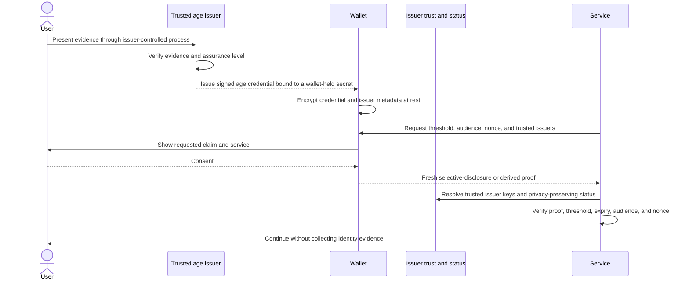

# Age Assurance Design

## Goal

Allow a user to complete a document-based age check once with a trusted verifier
and then prove an age threshold to multiple services from the wallet. A relying
service should learn only that its policy is satisfied, not the user's identity
documents, birth date, exact age, wallet ID, or activity at other services.

An executable orchestration demo now covers encrypted issuance, local policy
selection, explicit consent, presentation, and verifier replay protection. It
uses a clearly labeled shared-HMAC simulation adapter and does not satisfy the
production unlinkability or anonymous holder-binding requirements below.

## Terminology

- **Age verifier or issuer**: checks authoritative evidence and issues a signed
  wallet-held age credential.
- **Wallet or holder**: stores the credential and creates a consented presentation.
- **Relying service or verifier**: requests and validates an age-threshold proof.
- **Age credential**: an issuer-signed assurance from which the wallet can prove
  a threshold such as `age_over_18`.
- **Presentation**: a fresh proof derived for one service request. It is not the
  reusable credential itself.

## Intended flow

## Disclosure rules

A service request must specify:

- A canonical service or audience identifier.
- A minimum-age threshold.
- A fresh nonce and expiration time.
- Accepted issuers and assurance requirements.

The wallet must show those details before consent. A successful presentation
should disclose only the requested boolean result and the minimum issuer data
needed to evaluate trust. It must not disclose an exact age or birth date when a
threshold answer is sufficient.

The first practical claim set should use common policy thresholds such as
`age_over_13`, `age_over_16`, `age_over_18`, and `age_over_21`. Credentials need
an expiry or renewal policy because age assurance, document validity, issuer
trust, and jurisdictional requirements can change.

## Unlinkability requirements

The same signed credential must not be sent directly to each service. A stable
credential identifier, issuer signature, holder public key, or wallet ID would
allow colluding services to correlate presentations.

Each presentation must therefore be:

- Derived from the issuer credential without revealing a stable identifier.
- Bound to the requesting service and its fresh nonce.
- Bound to wallet-held secret material without exposing a global holder key.
- Different at the byte level when presented twice.
- Verifiable without contacting the issuer in a way that reports each use.

Pairwise login identities remain separate from age credentials. A service may
associate an approved age proof with its own pairwise account, but the credential
must not reveal the wallet's root public key.

## Trust and lifecycle

A relying service needs a policy for trusted issuers, accepted credential types,
minimum assurance, jurisdictions, expiry, and status. Issuer keys must be
discoverable and rotatable. The initial profile uses short-lived credentials and
expiry instead of suspension or revocation: conventional status-list indexes are
stable correlators. A later status mechanism must prove non-revocation without
revealing an index or causing a holder-specific online lookup.

The wallet must support:

- Encrypted credential storage and backup.
- Clear issuer, threshold, expiry, and status metadata.
- Explicit consent for every presentation.
- Deletion, renewal, and replacement.
- Multiple credentials from different issuers or jurisdictions.
- Device recovery without silently weakening holder binding.

## Standards direction

The conditional format decision is W3C Data Integrity BBS `bbs-2023` with
anonymous holder binding, transported with OpenID for Verifiable Credential
Issuance 1.0 and OpenID for Verifiable Presentations 1.0. See
[Age Credential Format Decision](age-credential-format-decision.md) for the
comparison and threat model.

Cryptographic implementation remains blocked because anonymous holder binding is
an at-risk Candidate Recommendation feature with draft Blind BBS dependencies.
The project will integrate an independently reviewed implementation only after
the interoperability gate in that decision is met. It will not implement custom
BBS or blind-signature primitives.

## Implementation roadmap

1. Define protocol-neutral age-proof requests, issuance offers, trust policies,
	and encrypted credential metadata: initial domain types and local filtering
	are prepared in `age_assurance.py`; issuance transport and status policy remain.
2. Select and threat-model a standards-based credential and presentation format:
	conditionally complete; implementation is gated on stable anonymous holder
	binding dependencies and reviewed library support.
3. Implement issuer discovery, key rotation, and privacy-preserving status checks.
4. Add wallet issuance, encrypted storage, consent, and presentation flows.
5. Add relying-service verification with audience and nonce enforcement.
6. Test replay, tampering, expiry, untrusted issuers, excessive disclosure, and
   cross-service linkability.

## Acceptance criteria

The feature is not complete until two colluding services cannot match valid
presentations using protocol-visible identifiers, the issuer cannot passively
observe every presentation, and a service learns no more than the requested age
threshold and necessary assurance information.

The browser demo is intentionally excluded from those cryptographic acceptance
criteria. Its `demo-simulated-proof-v1` format is a test fixture, not an
implementation or interoperability claim for W3C Data Integrity BBS.